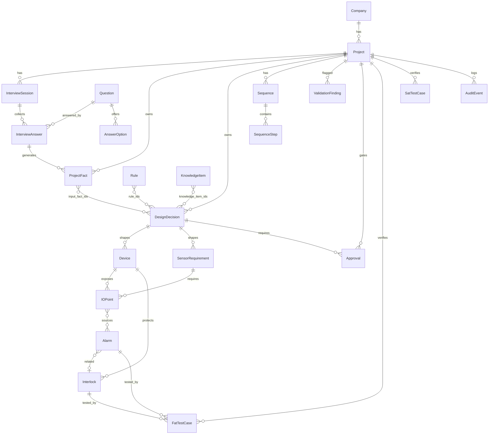
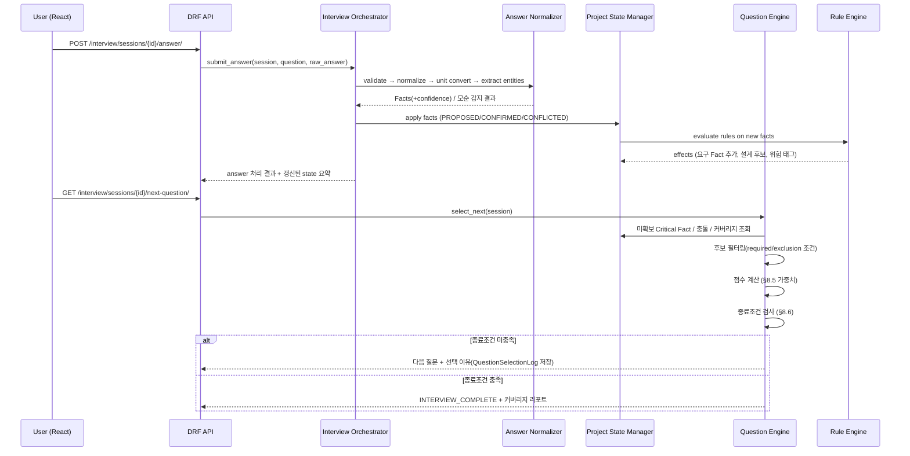

# PLC-Forge 개발 계획 (PLAN.md)

**기준 문서:** `docs/PRD.md` (v1.0)
**작성일:** 2026-07-06
**상태:** Phase 0 착수 전 — 계획 수립 단계 (구현 미착수)

---

## 1. 현재 저장소 상태

- `hataeyong/plc-forge` 저장소는 **빈 저장소**로 확인됨 (커밋 0개).
- 기존 구현이 없으므로 PRD와 충돌하는 코드 없음.
- 참고: 이 프로젝트는 당초 `hataeyong/church-ai` 세션에서 시작되었으나, 해당 저장소는
  Next.js + Supabase 기반의 무관한 프로젝트(에이맨)이므로 본 저장소로 분리되었다.
  이 결정은 확정 사항이다.

## 2. Gap Analysis

기존 코드가 없으므로 Gap = PRD 전체 범위. 요약:

| 영역 | PRD 요구 | 현재 | Gap |
|---|---|---|---|
| Backend | Django + DRF, 22개 앱, Service Layer | 없음 | 전체 신규 |
| Frontend | React(Vite), 17개 feature | 없음 | 전체 신규 |
| DB | PostgreSQL (JSONField + 정규화 혼합) | 없음 | 전체 신규 |
| Question Engine | 적응형 질문 선택 + 점수화 + 종료조건 | 없음 | 전체 신규 |
| Knowledge/Rule Engine | 8계층 KB + JSON 선언형 규칙 | 없음 | 전체 신규 + **초기 데이터 저작 필요** |
| Design Engine | 13종 설계 산출물 | 없음 | 전체 신규 |
| Validation Engine | 19종 검사 + CRITICAL 차단 | 없음 | 전체 신규 |
| Vendor IR/Adapter | 공통 IR + LS ELECTRIC PoC | 없음 | Phase 7 |
| 인프라 | Docker, Lint/Test, CI | 없음 | Phase 0 |

**가장 큰 리스크성 Gap은 코드가 아니라 도메인 데이터**(질문 50개, 지식항목, 규칙)의
저작이다. 엔진은 데이터 없이는 동작을 증명할 수 없다 → Phase 2~3에서 데이터 저작을
코드와 병행한다.

## 3. 목표 아키텍처

### 3.1 저장소 레이아웃 (Monorepo)

```text
plc-forge/
├── backend/
│   ├── config/               # Django settings (base/dev/prod), urls, wsgi/asgi
│   ├── apps/                 # 아래 3.2 App Boundary 참조
│   ├── core/                 # 공통: 예외/응답 포맷, BaseModel(UUID,버전,타임스탬프), LLM Interface
│   ├── manage.py
│   └── pyproject.toml        # ruff + pytest 설정
├── frontend/
│   └── src/                  # api/ components/ features/ hooks/ layouts/ pages/ routes/ stores/ types/ utils/
├── docs/
│   ├── PRD.md
│   └── (QUESTION_ENGINE_SPEC.md 등 확장 문서 — PRD §35)
├── docker-compose.yml        # postgres + backend + frontend
├── PLAN.md  TASKS.md  RISKS.md  ACCEPTANCE_CRITERIA.md  DECISIONS_REQUIRED.md  WORKLOG.md
└── README.md
```

### 3.2 Django App Boundary (확정안)

PRD §6의 22개 앱을 그대로 채택하되, 결합도가 높은 도메인의 소유권을 다음과 같이 정의한다.

| App | 소유 모델 (핵심) | 비고 |
|---|---|---|
| accounts | User, Role | 인증/권한 |
| companies | Company | |
| projects | Project | 프로젝트 루트, 버전 baseline |
| interview | InterviewSession, InterviewAnswer, Question, AnswerOption, QuestionSelectionLog | **Question Engine 서비스 소유** |
| knowledge | KnowledgeItem | 8계층 knowledge_type |
| requirements | Requirement, ProjectFact | Fact 저장소 + State Projection |
| processes | ProcessUnit, ProcessStep | 공정 모델 |
| devices | Device, DeviceType | 설비 |
| sensors | SensorRequirement, SensorCandidate | §14 파이프라인 |
| io_points | IOPoint | I/O List |
| communications | CommNode, CommLink, ProtocolRequirement | §16 |
| plc_design | PLCSizingResult, PLCCandidate | §15 |
| hmi_design | HMIScreen, HMITag | §17 |
| alarms | Alarm | §18 |
| interlocks | Interlock | §18, Cause&Effect는 alarms+interlocks에서 생성 |
| sequences | Sequence, SequenceStep | §19 |
| design | DesignDecision, Rule, RuleApplicationLog | **Rule Engine + Design Engine 서비스 소유** |
| validation | ValidationFinding | §22 |
| approvals | Approval, ApprovalHistory | §23 |
| generators | VendorIR, VendorAdapter 출력물 | Phase 7 |
| documents | ExportJob, DocumentTemplate | Excel Export |
| fat_sat | FatTestCase, SatTestCase, TestResult | §24 |
| audit | AuditEvent | 전역 감사로그 |

의존 방향 규칙: `audit`/`core` ← 모든 앱, `design` → (interview, requirements, knowledge),
설계 산출물 앱(sensors~fat_sat) → `design`. 역방향 import 금지. 앱 간 호출은
Service/Selector 함수를 통해서만 한다.

### 3.3 계층 규칙

- View(Set) → Serializer(입출력 검증만) → **services.py**(쓰기 로직) / **selectors.py**(읽기 로직) → models
- Django Signal은 핵심 워크플로에 사용 금지 (PRD §33-9)
- LLM 호출은 `core/llm/interface.py`의 추상 인터페이스 뒤에 두고, Rule-based
  fallback으로 LLM 없이도 MVP가 동작해야 함 (PRD §33-12,13)

## 4. 핵심 Domain Model ERD



주: `}o--o{` 다대다 연결(예: input_fact_ids)은 JSONField ID 배열이 아니라
**명시적 조인 테이블**(예: `DesignDecisionInput`)로 구현하여 Traceability 쿼리와
FK 무결성을 보장한다. (PRD §33-16: 핵심 검색 필드 정규화)

## 5. Question Engine 실행 흐름



## 6. Phase 계획 (Phase 0~7)

각 Phase는 (a) 시작 전 TASKS.md 갱신, (b) 종료 시 테스트 통과 + WORKLOG.md 갱신,
(c) 사용자 승인 후 다음 Phase 진행. (PRD §33)

### Phase 0 — Repository Bootstrap
- Django 5.x + DRF + PostgreSQL 16 + React 18(Vite) + Docker Compose 스캐폴드
- ruff(lint/format), pytest + pytest-django + factory-boy, Vitest + RTL, ESLint/Prettier
- `.env.example`, settings 분리(base/dev/prod), 통일된 API 오류 응답 포맷, health endpoint
- 한글(UTF-8) 저장/조회 왕복 테스트
- **Exit:** `docker compose up` 후 backend health 200, 프론트 렌더, 양쪽 테스트/린트 통과
- 세부 작업: `TASKS.md` 참조

### Phase 1 — Core Domain
- accounts, companies, projects, interview(Question/AnswerOption/InterviewSession/InterviewAnswer),
  requirements(ProjectFact), knowledge(KnowledgeItem), design(Rule, DesignDecision) 모델 + CRUD API
- BaseModel(UUID PK, created/updated, version), FactStatus 상태기계, AuditEvent 미들웨어(최소형)
- **Exit:** MVP 항목 1~10의 CRUD가 테스트로 검증, 마이그레이션 재현 가능

### Phase 2 — Question Engine
- 후보 필터링(required_conditions/exclusion_conditions/applicable_*) → 점수화(§8.5) →
  선택 이유 저장 → 종료조건(§8.6) 평가
- Answer Processing 파이프라인(§9)의 Rule-based 버전 (LLM 미사용으로도 동작)
- 초기 질문 데이터 50개(Phase 1 산업: 식품/수처리 우선) 저작 + fixture
- **Exit:** 시나리오 테스트 — "탱크 3개, 2개 가열, CIP 증기" 입력 → Fact 5종 생성,
  다음 질문이 SAFETY/SENSOR 카테고리로 수렴, 종료조건 미충족 시 계속 질문

### Phase 3 — Knowledge & Rule Engine
- KnowledgeItem 초기 데이터(§27 범위), Rule Matcher(conditions_json 평가기),
  Effect Executor, Hard Rule/Recommendation 구분, Conflict Detection
- **Exit:** §12 예시 규칙(Radar Level) 전 효과가 실행되고 근거가 DesignDecision에 기록됨

### Phase 4 — Design Engine
- Sensor(§14 파이프라인) → I/O Estimation → PLC Sizing(§15) → Communication(§16) →
  HMI(§17) → Alarm/Interlock(§18) → Sequence(§19) → FAT/SAT Draft(§24)
- 모든 DesignDecision에 Traceability(입력 Fact, 규칙, 지식, 신뢰도) 필수
- **Exit:** 인터뷰 완료 상태에서 `generate-design` 호출 시 13종 산출물 초안 생성,
  Traceability 체인 쿼리 테스트 통과

### Phase 5 — Validation & Approval
- Validation Engine(§22 검사 항목), ValidationFinding, Review Queue, Approval Workflow(§23)
- **CRITICAL Finding 존재 시 Vendor Generation 차단** 테스트 포함
- **Exit:** Approval 상태기계 전이 테스트, 차단 테스트 통과

### Phase 6 — Frontend
- Adaptive Interview, Project State, Design Preview, Validation, Approval, Excel Export UI
- **Exit:** E2E(Playwright) — 인터뷰 시작→답변→설계 생성→검토→승인→Export 해피패스

### Phase 7 — LS ELECTRIC Adapter PoC
- Vendor Independent IR(§20) 스키마 → ST Generator, Tag/IO/Alarm CSV, Vendor Mapping Report
- **Exit:** 샘플 프로젝트 IR → ST + CSV 4종 + 리포트 생성, IR 스키마 검증 테스트

## 7. 추정 vs 확정 구분

- **확정(PRD 명시):** 스택, 앱 목록, 모델 필드, 점수 요소, 종료조건, MVP 범위, Phase 순서
- **추정(구현 시 결정 필요):** 점수 가중치 수치, conditions_json 문법(JSONLogic 채택 제안),
  ProjectState Projection 방식(온디맨드 계산 제안), 인증 방식, 배포 대상
  → `DECISIONS_REQUIRED.md` 참조
